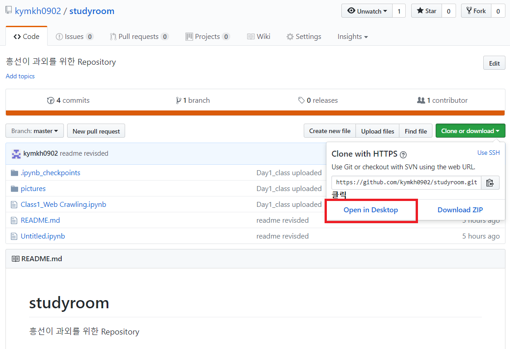
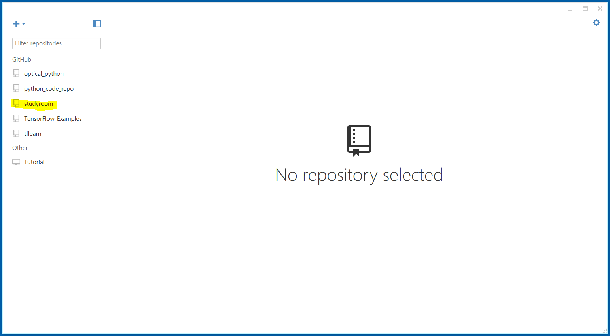

# studyroom
흥선이 과외를 위한 Repository 

### 커리큘럼

**1. Web Crawling**

  - 라이브러리 : requests, BeautifulSoap, scrapy, pandas
  
  - 활용 목적 : 업무 중 웹 상에서 정보 끌어오는 부분 자동화를 위함

  - 준비 사항 : 업무 중 정보 끌어오는 웹 페이지 목록, 방법에 대한 간단 기술

  - 학습 일정 : 
  
  
  
| 일정        | 학습 내용         |
| :-------------: |:------------- 
| 7/15      | 웹의 HTML 및 데이터 구조 확인. requests, BeautifulSoup를 이용한 웹 크롤링 학습| 
| 7/22      | scrapy를 활용한 웹 크롤링 학습 |
| 7/29      | task scheduler를 활용한 웹 크롤링 자동화 학습 |

**2. API 사용하기**

  - 업데이트 예정
  
  
  
  
**부록. Github 설치하기**

매번 수업자료를 수정할 때 마다 공유해줄 수도 없고 그렇다고 100% 확실한 수업자료를 한 번에 만들기도 불가능해서 

Github라는 온라인 저장소를 이용해서 수업자료를 실시간으로 update할 예정입니다. 

미리 예습을 해도 좋고 복습을 해도 좋고 본인 역량에 따라서 진도는 나가면 되고 

항상 자료는 진도보다 앞설 것이기 때문에 더 빨리 많은 것을 익히고 싶으면 예습하면 됩니다.

아래 링크를 통해 Github을 다운 받아 설치합니다. 
(https://github-windows.s3.amazonaws.com/GitHubSetup.exe)

설치가 완료되면 아래 아이콘이 생성될 것입니다.

이제 Github 계정을 만들어봅시다. https://github.com 에 접속해서 Sign in을 눌러 회원가입을 합니다.

회원가입이 다 되었으면 수업자료 저장소(https://github.com/kymkh0902/studyroom)에 들어가서 Clone을 해봅시다. 
아래 Open in Desktop을 클릭해줍니다. 

 

아래 그림과 같이 GitHub가 켜지면서 저장 경로가 뜰겁니다. 경로는 편한데 저장하시면 됩니다.

여기까지하면 Github 설치, 내 컴퓨터에 수업자료 저장소 동기화가 완료된 것입니다. 

추가적으로 Git Shell이라는 프로그램을 이용해서 수업자료를 받고 나중에 올리는 작업을 진행할 예정인데 설명 자료 올려놨으니 궁금하면 봐도 됩니다.

  